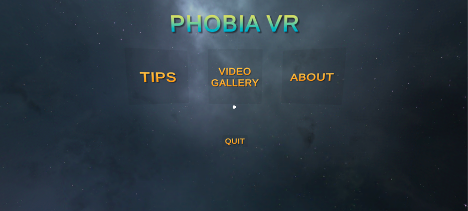
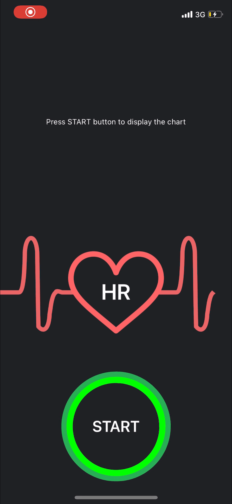
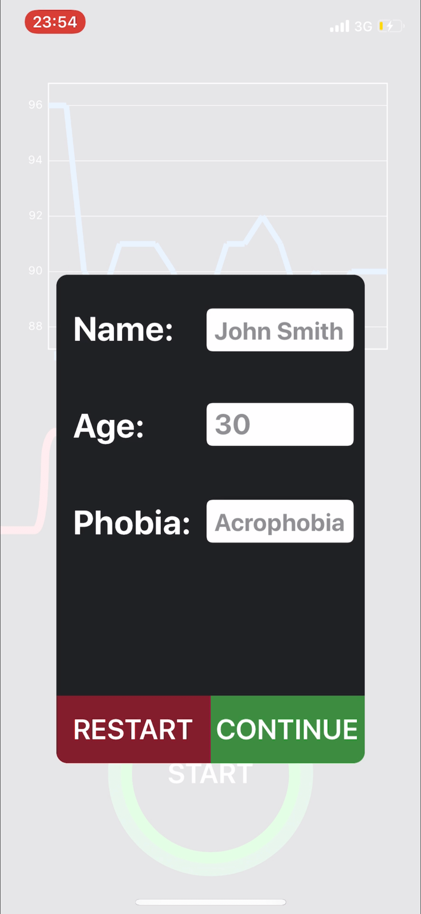

# **VRPhobia**
## **_OER Project Focusing On Delivering Phobias Through A Virtual Environment and Monitoring Health Conditions by Utilizing Wearable Technology Devices_**

### Introduction
This project was presented as partial fulfillment of the conditions for the award of the degree **BSc Computer Science** at Nottingham University.

The platform consists two components: VR application to deliver phobia-motivated experiences, and a Heart Rate (HR) monitor application which is responsible for measuring user's rate, and deliver the results to a healthcare professional. At the moment, both applications are only available for iOS devices.

### VR Application

The current version of the VR application consists of three videos taken from Youtube hosting platform. All videos are licensed by Creative Commons Attributions license (CC BY). Additionally, all videos were resized and edited to minimize the application's size.

Unity IDE was used to create the application which was later converted to Xcode project. The source code of the application is available in this repository.

|          VR App             |  VR App Video Gallery    |  
|:---------------------------:|:------------------------:|
        |  

### HR application

The HR monitor application is based on the communication between an iOS and watchOS devices. Apple Watch 5 and iPhone X (64GB) were used during the testing phase. Currently the application's features include: measuring, displaying and storing user's heart rate in a form of a chart, taking user's input (name, age, phobia description) and showing results page to the user with all recorded information. Additionally, users can share the information through online services, such as email, with their healthcare professional.

Xcode IDE was used to create the application. [iOS Charts](https://github.com/danielgindi/Charts) framework was used to display the heart rate readings in a form of a chart.

|Main Menu|HR Recrording|User Input|Results|
|:-:|:-:|:-:|:-:|
|||

### Publications
The work surrounding this project has resulted in two academic papers. One presented at IEEE conference on Teaching, Assessment and Learning for Engineering (IEEE TALE [[1]](#ref1)) and one accepted to appear in the Proceedings of the 44th IEEE Annual Computer Software and Applications Conference, COMPSAC 2020 [[2]](#ref2).

### Future Work
In the future, it is planned to expand the system by adding more videos to the VR library and adding more sensors, such as Galvanic Skin Response (GSR) and Electroencephalogram (EEG). Additionally, Metamorphic Testing was applied during the testing phase of HR application and helped in finding a bug in the watchOS system, thus MT could be a good method to investigate potential problems in mobile applications and also alleviating an Oracle Problem in VR apps.

### References
<a name="ref1">
[1] James Walker, Denis Stepanov, Dave Towey, Ahmed Elamin, Matthew Pike, and Ran Wei. Creating a 4D photoreal VR environment to teach civil engineering. In IEEE International Conference on Teaching, Assessment, and Learning for Engineering (TALE 2019), pages 1006-1013, 2019
</a>

 

<a name="ref2">
[2] Denis Stepanov, Dave Towey, Tsong Yueh Chen, and Zhi Quan Zhou. A Virtual Reality OER Platform to Deliver Phobia-motivated Experiences, N.D. accepted to appear in the Proceedings of the 44th IEEE Annual Computer Software and Applications Conference, COMPSAC 2020
</a>
